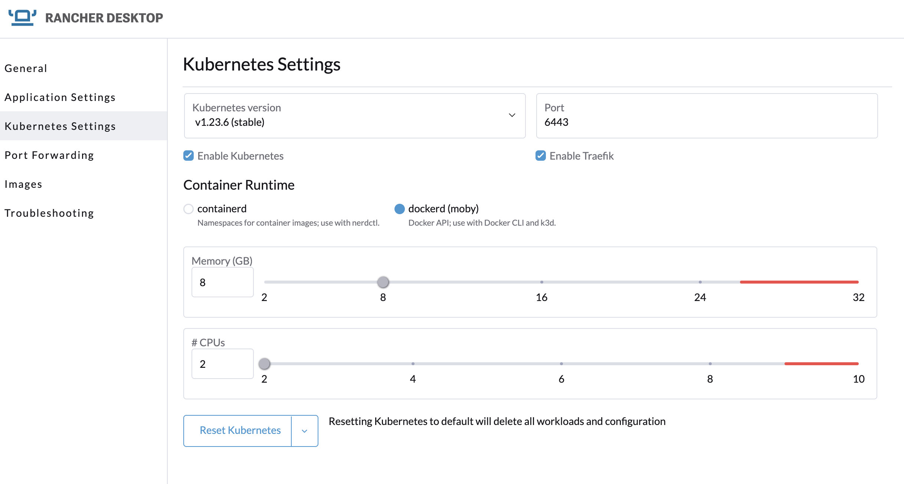

## Description
THe following will deascribe how to build and test an API using `Rancher Desktop` then deploy the image into a Kubernetes cluster

Rancher should be setup to run Kubernetes, and dockerd(moby) Container Runtime


## Build the image
First build the image and store in our local 

``` bash
docker build -t k8sapi .
```

## Run in Kubernetes
As we're using the K8s API,  and need to authenticate, we can do this using the `inCLuster` config.   
We will also be limited by RBAC, so should created the following items: -
- ServiceAccount
- ClusterRole
- ClusterRoleBinding

``` bash
kubectl apply -f k8s/rbac.yaml
```

Now we can deploy the application, and front it with a LoadBalancer which can be used for port-forwarding later.  The key point here is that the Deployment uses the ServiceAccount created in the previous step, and gets access to the relevant K8s API.

``` bash
kubectl apply -f k8s/svc-deploy.yaml
```


### Left for Rancher Desktop reference
Ignore this
``` bash
kubectl run --image k8sapi k8sapi --image-pull-policy='Never'
```